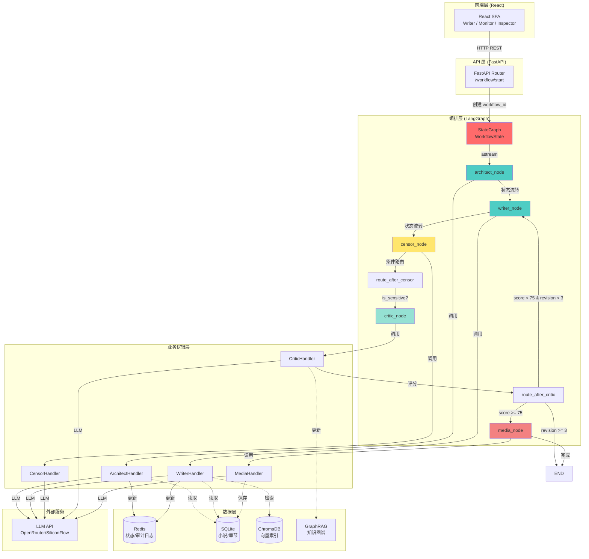
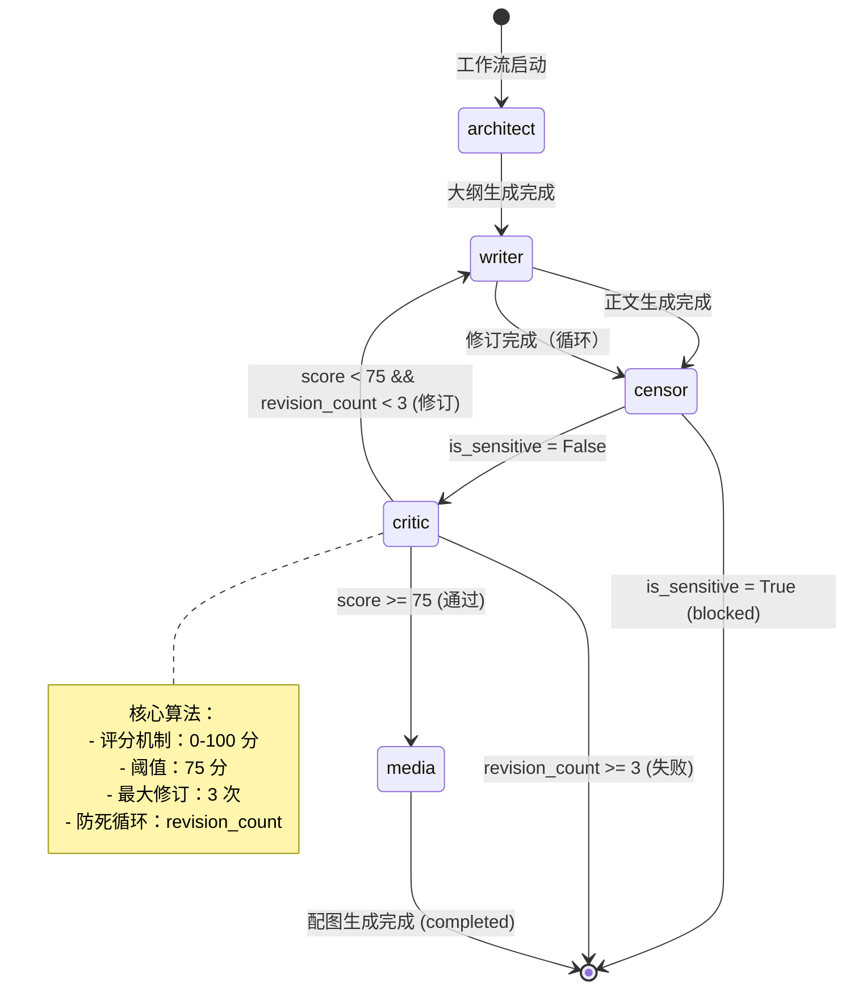

# Prometheus Forge

**Igniting Creative Intelligence Through LangGraph State Machine**

*普罗米修斯工坊 / 火种工坊*

[](https://www.python.org/)
[](https://fastapi.tiangolo.com/)
[](https://react.dev/)
[](https://www.typescriptlang.org/)
[](https://langchain-ai.github.io/langgraph/)
[](https://redis.io/)
[](LICENSE)

基于 **LangGraph 状态机**的多智能体小说创作系统，具备自动质量反馈环、向量检索上下文、知识图谱与全链路可观测能力。

---

## 🎯 项目简介

**Prometheus Forge** 是一套基于 **LangGraph** 状态机编排的 AI 小说创作引擎。采用 **FastAPI + React** 前后端分离架构，通过 **LangGraph** 实现智能体间的状态流转与条件路由，替代了传统的 Controller 循环模式。

### 核心价值

- **🧠 状态机编排**：使用 LangGraph 构建声明式工作流，状态管理清晰、可追溯
- **🔄 自我修正（Self-Refinement）**：Critic 智能体评分机制，自动触发 Writer 修订循环，确保内容质量
- **🛡️ 安全审查**：Censor 智能体作为安全层，拦截敏感内容
- **📊 全链路可观测**：每个节点执行状态实时同步到 Redis，前端可视化工作流拓扑
- **🔍 向量检索增强**：ChromaDB 语义搜索 + GraphRAG 知识图谱，维护长线剧情一致性

---

## 🏗️ 系统架构

### 技术方案选择

我们选择 **LangGraph** 作为核心编排引擎，原因如下：

1. **状态管理**：LangGraph 提供类型安全的 `TypedDict` 状态定义，状态流转清晰可追踪
2. **图编排**：声明式 DAG（有向无环图）定义，支持条件边和循环，比传统 Controller 循环更灵活
3. **持久化**：内置状态持久化支持，可与 Redis 无缝集成
4. **可观测性**：每个节点执行可被监控，便于调试和优化
5. **异步支持**：原生支持 `AsyncGraph`，适合 IO 密集的 LLM 调用场景

### 架构图



### 数据流

```
用户发起工作流 (POST /workflow/start)
    ↓
FastAPI 生成 workflow_id，初始化 Redis 状态
    ↓
LangGraph StateGraph 启动 (architect 节点)
    ↓
architect_node → ArchitectHandler._process → LLM API
    ↓ (状态更新: outline, reference_context)
writer_node → WriterHandler._process → LLM API
    ↓ (状态更新: draft_content)
censor_node → CensorHandler._process → LLM API
    ↓ (状态更新: is_sensitive)
    ├─ is_sensitive = True → END (blocked)
    └─ is_sensitive = False → critic_node
critic_node → CriticHandler._process → LLM API
    ↓ (状态更新: critique_score, critique_comments)
    ├─ score >= 75 → media_node
    ├─ score < 75 & revision_count < 3 → writer_node (循环)
    └─ revision_count >= 3 → END (failed)
media_node → MediaHandler._process → LLM API
    ↓ (状态更新: media_url)
    ↓
END (completed)
```

---

## 🧠 核心工作流与算法

### Agent 协同算法

系统通过 LangGraph 状态机编排 5 个核心智能体，实现从大纲生成到最终成品的全流程自动化。

#### 1. 🏛️ Architect（架构师）

**职责**：生成章节大纲

- **输入**：`novel_name`, `chapter_num`, `reference_context`（人物设定、世界观、前文）
- **处理**：调用 LLM 生成结构化大纲（JSON 格式，包含场景列表）
- **输出**：`outline`（JSON 字符串），`reference_context`（增强的上下文）

**实现位置**：`src/workflow/nodes.py::architect_node` → `src/workers/handlers/architect.py::ArchitectHandler._process`

#### 2. ✍️ Writer（写手）

**职责**：基于大纲撰写正文

- **输入**：`outline`, `reference_context`, `feedback`（可选，用于修订）
- **处理**：
  - 解析大纲中的场景列表
  - 按场景顺序依次生成（支持 Hybrid RAG 检索增强）
  - 支持修订模式（基于 `feedback` 调整写作）
- **输出**：`draft_content`（完整章节正文）

**实现位置**：`src/workflow/nodes.py::writer_node` → `src/workers/handlers/writer.py::WriterHandler._process`

#### 3. 🛡️ Censor（审查员）

**职责**：敏感内容拦截（安全层）

- **输入**：`draft_content`
- **处理**：LLM 审查 + 敏感词表检查
- **输出**：`is_sensitive`（布尔值），`censor_reason`（敏感原因）

**路由逻辑**：
- `is_sensitive = True` → **END**（工作流终止，状态：`blocked`）
- `is_sensitive = False` → **critic**（继续审稿）

**实现位置**：`src/workflow/nodes.py::censor_node` → `src/workflow/graph.py::route_after_censor`

#### 4. 🎯 Critic（审稿员）- 核心算法

**职责**：内容质量评分与改进建议

- **输入**：`draft_content`, `outline`, `reference_context`
- **处理**：调用 LLM 进行多维度评估（剧情逻辑、人设一致性、文笔流畅度、大纲符合度）
- **输出**：`critique_score`（0-100），`critique_comments`（改进建议）

**路由算法**（`route_after_critic`）：

```python
if critique_score >= 75:
    → media_node  # 通过，生成配图
elif revision_count < 3:
    revision_count += 1
    feedback = critique_comments
    → writer_node  # 打回重写（循环）
else:
    → END  # 达到最大修订次数，强制结束（failed）
```

**防死循环设计**：
- `revision_count` 作为循环计数器，初始值为 0
- 每次打回 Writer 时自动递增
- 达到阈值（默认 3 次）后强制终止，避免无限循环

**实现位置**：`src/workflow/nodes.py::critic_node` → `src/workflow/graph.py::route_after_critic`

#### 5. 🎨 Media（媒体生成）

**职责**：生成章节配图

- **输入**：`draft_content` 或 `outline`（场景描述）
- **处理**：LLM Prompt Engineering → 图片生成 API
- **输出**：`media_url`（图片 URL）

**实现位置**：`src/workflow/nodes.py::media_node` → `src/workers/handlers/media.py::MediaHandler._process`

### 状态流转图



---

## 🛠️ 技术栈

| 层级 | 技术 | 版本 | 用途 |
|------|------|------|------|
| **编排引擎** | LangGraph | 0.0.20+ | 状态机编排、工作流图定义 |
| **前端** | React | 19.2 | UI 框架 |
| | TypeScript | 5.9 | 类型安全 |
| | Vite | 7.2+ | 构建工具 |
| | Tailwind CSS | 4.1+ | 样式框架 |
| | TanStack Query | 5.90+ | 数据获取与缓存 |
| | React Flow | 12.10+ | 工作流拓扑图可视化 |
| | react-force-graph-2d | 1.29+ | 知识图谱可视化 |
| **API** | FastAPI | 0.100+ | REST API 框架 |
| | Pydantic | 2.0+ | 数据验证 |
| | SQLAlchemy | 2.0+ | ORM（async + aiosqlite） |
| **状态与任务** | Redis | 7.0+ | 状态存储、审计日志、任务队列 |
| | Celery | 5.3+ | 异步任务处理（Legacy 支持） |
| **持久化** | SQLite | - | 小说、章节、草稿、提示词模板 |
| **向量检索** | ChromaDB | 0.4+ | 语义搜索 |
| | Sentence Transformers | 2.2+ | 文本向量化（bge-small-zh） |
| **知识图谱** | GraphRAG | - | 实体抽取、关系构建、时空属性 |
| **LLM** | OpenAI 兼容 API | 1.0+ | OpenRouter、SiliconFlow 等 |

---

## 📁 项目结构

```
novel-agent/
├── src/
│   ├── api/                    # 🚀 FastAPI 应用层
│   │   ├── routers/           # REST API 路由
│   │   │   ├── workflow.py    # 工作流启停、状态查询
│   │   │   ├── novels.py      # 小说/章节 CRUD
│   │   │   ├── monitor.py     # 资源监控
│   │   │   └── ...
│   │   ├── services/          # 业务服务层
│   │   └── schemas/           # Pydantic 模型
│   │
│   ├── workflow/              # 🧠 LangGraph 编排层（核心）
│   │   ├── state.py           # WorkflowState 定义
│   │   ├── nodes.py           # Agent 节点适配器（async）
│   │   ├── graph.py           # 工作流图构建与路由逻辑
│   │   └── import_graph.py    # 导入工作流（独立）
│   │
│   ├── workers/               # ⚙️ Celery Worker 层（Legacy/Async）
│   │   ├── tasks_new.py      # 新架构任务定义（Celery）
│   │   ├── controller_tasks.py # Controller 任务
│   │   └── handlers/          # Agent 处理器
│   │       ├── architect.py  # 大纲生成
│   │       ├── writer.py      # 正文生成/修订
│   │       ├── critic.py      # 质量审稿
│   │       ├── censor.py     # 敏感审查
│   │       ├── media.py      # 配图生成
│   │       └── knowledge.py   # 知识更新
│   │
│   ├── core/                  # 🔧 核心基础设施
│   │   ├── controller.py     # Controller（Legacy，逐步废弃）
│   │   ├── state_manager.py  # Redis 状态管理
│   │   ├── dispatcher.py     # 事件分发器
│   │   ├── celery_config.py  # Celery 配置
│   │   ├── workflows.py      # 工作流注册表
│   │   ├── routing.py        # 路由规则定义
│   │   └── ...
│   │
│   ├── agents/                # 🤖 LLM 交互层
│   │   ├── builder.py        # 上下文构建
│   │   ├── writer.py         # 写作 Agent
│   │   └── reviewers/        # 专项审查团队
│   │
│   ├── rag/                   # 🔍 向量检索与知识图谱
│   │   ├── indexer.py        # ChromaDB 索引
│   │   ├── retriever.py      # 语义检索
│   │   ├── hybrid.py         # 混合检索（向量+图谱）
│   │   └── graph_store.py    # GraphRAG 存储
│   │
│   ├── utils/                 # 🛠️ 工具模块
│   │   ├── file_manager.py   # 文件管理（部分已弃用）
│   │   └── novel_query.py    # 小说查询
│   │
│   └── main_graph.py          # 🎯 LangGraph 执行入口
│
├── web/                       # 💻 React 前端
│   └── src/
│       ├── pages/            # 页面组件
│       ├── components/       # UI 组件
│       ├── hooks/            # 自定义 Hooks
│       └── api/              # API 客户端
│
├── config/                    # ⚙️ 配置文件
│   ├── settings.yaml         # 全局配置
│   └── prompts/             # 提示词模板
│
├── data/                      # 💾 数据存储
│   ├── novel_content_db/     # SQLite 数据库
│   ├── graph_store/          # GraphRAG JSON 文件
│   └── test_chroma_db/       # ChromaDB 测试数据
│
├── scripts/                   # 🔧 工具脚本
│   ├── install_dependencies.bat
│   ├── start_backend.bat
│   └── ...
│
├── start_all_tabs.bat         # 🚀 一键启动（多标签页）
└── docker-compose.yml         # 🐳 Redis 服务编排
```

---

## 🚀 快速开始

### 环境要求

- **Python 3.10+**（推荐使用 Conda）
- **Node.js 18+**
- **Docker**（用于 Redis）
- **Redis 7.0+**（通过 Docker 启动）

### 1. 克隆项目

```bash
git clone <your-repo-url>
cd novel-agent
```

### 2. 环境配置

#### 2.1 创建 Conda 环境

```bash
conda env create -f environment.yml
conda activate novel-agent
```

#### 2.2 配置环境变量

创建 `.env` 文件（参考 `.env.example`）：

```bash
# API Keys
OPENROUTER_API_KEY=sk-or-v1-...
# 或
SILICONFLOW_API_KEY=sk-...

# Model Configuration
DEFAULT_PROVIDER=openrouter
DEFAULT_MODEL=deepseek/deepseek-chat
DEFAULT_TEMPERATURE=1.0

# Redis Configuration
REDIS_HOST=localhost
REDIS_PORT=6379
```

### 3. 启动服务

#### 3.1 启动 Redis

```bash
docker-compose up -d
```

#### 3.2 启动后端 API

```bash
# 方式 A：一键启动（推荐，Windows Terminal 多标签页）
start_all_tabs.bat

# 方式 B：手动启动
uvicorn src.api.main:app --reload --port 8000
```

#### 3.3 启动前端

```bash
cd web
npm install
npm run dev
```

**访问地址**：
- 前端：**http://localhost:5173**
- API：**http://localhost:8000**
  - 健康检查：`GET http://localhost:8000/health`
  - API 文档：`http://localhost:8000/docs`

### 4. 运行测试

#### 4.1 LangGraph 工作流测试

```bash
# 运行 LangGraph 回归测试（极简用例，低 Token 消耗）
python src/main_graph.py
```

#### 4.2 前端功能测试

1. 打开 **http://localhost:5173**
2. 进入 **写作** 页面，选择或新建小说与章节
3. 发起工作流，观察 **监控** 页面的拓扑图与追踪时间线
4. 进入 **索引洞察**，查看向量索引与知识图谱可视化

---

## 🧪 核心特性详解

### 1. 🧠 LangGraph 状态机编排

**技术优势**：
- **声明式工作流**：使用 `StateGraph` 定义 DAG，比命令式 Controller 循环更清晰
- **类型安全**：`WorkflowState` (TypedDict) 提供编译时类型检查
- **状态持久化**：每个节点执行后自动同步到 Redis，支持工作流恢复
- **条件路由**：`route_after_critic` 等函数实现智能决策，支持循环与终止

**实现位置**：
- 图定义：`src/workflow/graph.py::create_workflow_graph()`
- 节点实现：`src/workflow/nodes.py`（5 个异步节点函数）
- 状态定义：`src/workflow/state.py::WorkflowState`

### 2. 🔄 自我修正（Self-Refinement）算法

**核心机制**：Critic 评分 → 自动修订循环

```python
# 路由逻辑（src/workflow/graph.py::route_after_critic）
if critique_score >= 75:
    return "media"  # 通过
elif revision_count < 3:
    state["revision_count"] += 1
    state["feedback"] = critique_comments
    return "writer"  # 打回重写（循环）
else:
    return "__end__"  # 达到最大修订次数，终止
```

**防死循环设计**：
- `revision_count` 初始值为 0
- 每次打回 Writer 时自动递增
- 达到阈值（默认 3 次）后强制终止，状态设为 `failed`

**优势**：
- 自动优化内容质量，无需人工干预
- 可配置的修订次数上限，平衡质量与成本
- 清晰的终止条件，避免无限循环

### 3. 🛡️ 安全审查层

**Censor 智能体**作为安全层，在工作流中起到关键作用：

- **位置**：Writer 之后，Critic 之前
- **机制**：LLM 审查 + 敏感词表检查
- **路由**：敏感内容直接终止工作流（`status: blocked`），不进入审稿环节

### 4. 📊 全链路可观测

**状态同步机制**：
- 每个节点执行后，`WorkflowState` 自动同步到 Redis
- 前端通过 `GET /workflow/{id}/state` 实时查询状态
- 审计日志记录每个节点的执行时间、输入输出

**可视化**：
- **工作流拓扑图**：React Flow 展示节点流转
- **追踪时间线**：按时间顺序展示节点执行历史
- **知识图谱**：2-Hop 同心圆布局，支持时空维度过滤

### 5. 🔍 向量检索增强（RAG）

**Hybrid 检索**：
- **向量检索**：ChromaDB 语义搜索，找到相似章节片段
- **图谱检索**：GraphRAG 实体关系查询，找到相关人物/地点
- **混合结果**：两种检索结果合并，增强 Writer 的上下文

**实现位置**：`src/rag/hybrid.py::hybrid_retrieve()`

---

## 📖 使用示例

### 通过 API 启动工作流

```python
import requests

# 启动工作流
response = requests.post("http://localhost:8000/workflow/start", json={
    "novel_name": "我的小说",
    "chapter_num": 1,
    "workflow_type": "generate_chapter",
    "use_langgraph": True  # 使用 LangGraph 编排
})

workflow_id = response.json()["workflow_id"]

# 查询状态
state = requests.get(f"http://localhost:8000/workflow/{workflow_id}/state").json()
print(f"状态: {state['status']}, 当前节点: {state.get('current_agent')}")

# 查询追踪日志
trace = requests.get(f"http://localhost:8000/workflow/{workflow_id}/trace").json()
for entry in trace:
    print(f"{entry['timestamp']} - {entry['source']}: {entry['event_type']}")
```

### 直接运行 LangGraph 工作流

```python
import asyncio
from src.main_graph import run_workflow

async def main():
    workflow_id = "test-001"
    final_state = await run_workflow(
        workflow_id=workflow_id,
        novel_name="测试小说",
        chapter_num=1,
        workflow_type="generate_chapter",
        sync_to_redis=True
    )
    print(f"工作流完成: {final_state['status']}")
    print(f"审稿评分: {final_state.get('critique_score')}")

asyncio.run(main())
```

---

## 🔧 配置说明

### 模型配置 (`config/settings.yaml`)

```yaml
model:
  provider: openrouter  # 或 siliconflow
  name: deepseek/deepseek-chat
  temperature: 1.0
  max_tokens: 4096

paths:
  workspace: ./workspace
  chroma_db: ./data/chroma_db
  database: ./data/novel_content_db/prometheus_forge.db
```

### 工作流配置

- **修订次数上限**：默认 3 次（可在 `route_after_critic` 中修改）
- **评分阈值**：默认 75 分（可在 `route_after_critic` 中修改）

---

## 🧩 扩展指南

### 添加新 Agent

1. **实现 Handler**：在 `src/workers/handlers/` 下创建新 Handler
2. **创建 Node**：在 `src/workflow/nodes.py` 中添加异步节点函数
3. **更新图**：在 `src/workflow/graph.py` 中添加节点和边
4. **更新状态**：在 `src/workflow/state.py` 中添加必要的状态字段

### 自定义工作流类型

在 `src/core/workflows.py` 中注册新工作流类型，并在 `create_workflow_graph()` 中实现对应的图结构。

---

## 📚 相关文档

由于 `docs/` 目录已清理，核心文档已整合到本 README。如需详细了解：

- **API 接口**：访问 `http://localhost:8000/docs`（Swagger UI）
- **代码注释**：各模块均有详细的 docstring
- **架构设计**：参考 `src/workflow/graph.py` 中的注释

---

## 🗺️ 路线图

### 当前版本（v2.0）

- ✅ LangGraph 状态机编排
- ✅ 自动质量反馈环（Self-Refinement）
- ✅ 安全审查层（Censor）
- ✅ 全链路可观测（工作流监控）
- ✅ 向量检索增强（Hybrid RAG）
- ✅ 知识图谱可视化

### 计划功能

- 🔄 WebSocket 流式输出（实时显示生成进度）
- 🔄 可选本地 LLM（Ollama 支持）
- 🔄 多工作流类型扩展（outline_only, content_only 等）
- 🔄 图谱编辑功能（手动调整实体关系）

---

## 🤝 贡献

欢迎提交 Issue 和 Pull Request！

---

## 📄 许可证

MIT License。详见 [LICENSE](LICENSE) 文件。

---

## 🙏 致谢

感谢以下开源项目：

- [LangGraph](https://langchain-ai.github.io/langgraph/) - 状态机编排引擎
- [FastAPI](https://fastapi.tiangolo.com/) - 现代 Python Web 框架
- [React](https://react.dev/) - UI 框架
- [ChromaDB](https://www.trychroma.com/) - 向量数据库
- [react-force-graph-2d](https://github.com/vasturiano/react-force-graph-2d) - 知识图谱可视化

---

**Prometheus Forge** - 点燃创意智能，通过 LangGraph 状态机编排 🚀
